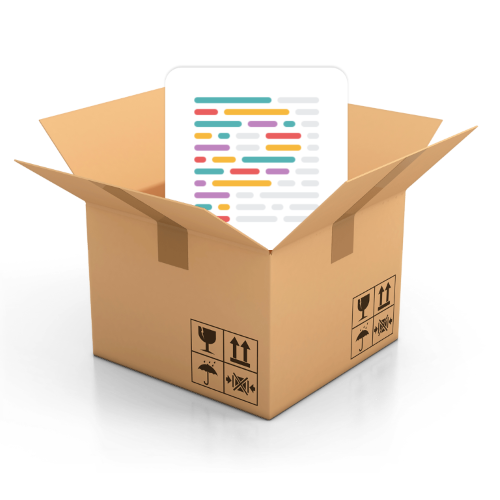

# parcel-plugin-prettier  [](https://badge.fury.io/js/parcel-plugin-prettier)

Parcel plugin to add Prettier to your build. The plugin off-loads the prettifying work to your bundler instead of your code editor/IDE. 

---

[【What is Parcel】](https://parceljs.org/) [【What is Prettier】](https://prettier.io/)

## Installation

Parcel will automatically start using the plugin once its added to your package.json file.

To add the plugin to your existing project, run the below command.

```
npm i parcel-plugin-prettier -D
```
or
```
yarn add parcel-plugin-prettier -D
```

## Configuration

The plugin reads the configuration for prettier from the .prettierrc in your root directory and applies the same.

## License

This project is licensed under the MIT License - see the [LICENSE](LICENSE) file for details